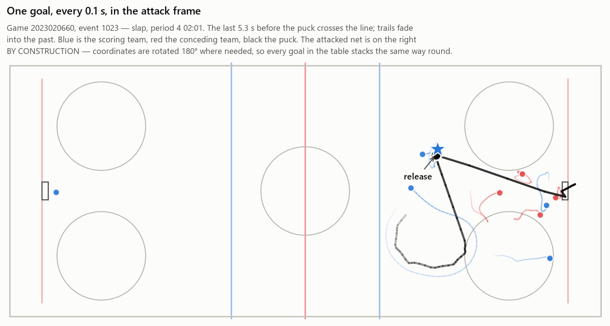
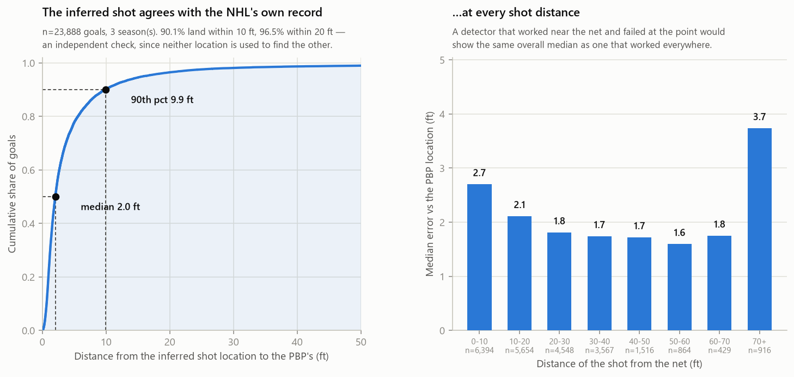

# NHL goal-tracking pipeline

Scrapes NHL player-tracking data from the public goal-recreation feed,
reconciles it against the official play-by-play and shift charts, and produces
analysis-ready tables.

The NHL publishes frame-by-frame positional tracking for **goal events only**,
through the goal-recreation ("sprites") endpoint. Each goal comes as a 12–14
second clip at 10 fps. This pipeline determines when in that clip the shot was
released, measures every on-ice player's distance to the puck at that instant,
and writes a per-goal audit row recording how much to trust it.

Three seasons are available: **2023-24, 2024-25 and 2025-26**, 1,312
regular-season games each, ~24,000 goal events, 7.2 GB of raw JSON.

---

## Feed behaviour that affects the measurement

Five properties of the raw feeds will corrupt distances computed from them. Each
is handled here, with the fix calibrated against data.

**1. The last frame is not the goal.** Recording continues while the puck sits
in the net — a median **3.4 s**, during which the scorer skates in to celebrate.
The goal instant is found from puck motion: the puck moves a median **2.0
ft/frame during live play and 0.07 ft/frame once dead**.

**2. The goal frame is not a usable measurement point.** With the puck in the
net, the nearest player is the goalie **66%** of the time and a defenceman
another **14%**. It is the recorded scorer only **4.6%** of the time, so any
distance measured there is outcome-conditioned.

**3. Nothing in the clip marks the shot release.** The play-by-play names the
scorer, so the pipeline searches for *when* the puck was last at that player
rather than inferring *who* had it from puck kinematics. The resulting shot
location sits a median **2.04 ft** from the play-by-play's own recorded shot
coordinates, 90% within 10 ft, over all 23,888 goals where both exist.

**4. Benches empty on overtime winners.** The tracker records everyone who comes
over the boards — up to **35 "on-ice" players**, one 3v3 goal showing 17 skaters
for a single team. Handled by plausibility bounds on the anchor frame, and by
taking rosters from the shift charts rather than from tracking.

**5. The shift-chart feed returns empty bodies.** HTTP 200 with `total = 0`, for
contiguous blocks of games: 57 in 2024-25 and **505 in 2025-26 (38% of the
season)**. Affected games have no on-ice rosters unless you fall back to the
HTML TOI reports, which this pipeline does. Parsed against the JSON feed on 12
games that have both, per-player TOI correlates **0.99998**, with shift counts
matching exactly for 99.3% of players.

A sixth applies only if you use the coordinates directly: the sprite y-axis runs
**opposite** to the play-by-play's. Because distances reduce y to a `hypot`
around a net at `y = 0`, an inverted y is invisible in every distance the
pipeline emits, but not in rink maps or play-by-play joins. See
[docs/METHODS.md §3](docs/METHODS.md).

---

## Documentation

| Doc | Contents |
|---|---|
| [docs/METHODS.md](docs/METHODS.md) | Every processing decision and the measurement behind it |
| [docs/FIELD_REFERENCE.md](docs/FIELD_REFERENCE.md) | Field-level documentation for every endpoint, with confidence markers |
| [docs/DATA_SOURCES.md](docs/DATA_SOURCES.md) | The endpoints, what each returns, and their quirks |
| [docs/SCHEMA.md](docs/SCHEMA.md) | On-disk layout and output table columns |
| [docs/RAW_ARCHIVE.md](docs/RAW_ARCHIVE.md) | The published raw archive: contents, checksums, coverage |

None of these payloads are documented by the NHL. The community reference at
[Zmalski/NHL-API-Reference](https://github.com/Zmalski/NHL-API-Reference) covers
endpoint paths and parameters but not response fields. The field reference was
derived by profiling the raw archive; every entry is marked ✅ verified,
⚠️ inferred, or ❓ unknown, with the open questions listed.

Two findings from that work:

- **The play-by-play carries the sprite URL.** Goal plays include a
  `pptReplayUrl` field whose value is the sprite endpoint, so the URL does not
  have to be constructed.
- **The sprite `timeStamp` is deciseconds since the Unix epoch**, stepping
  exactly +1 per frame, rather than the opaque tick counter it is usually
  described as. This confirms the 10 fps rate independently of the speed test.

---

## What it produces

| Table | Grain | Contents |
|---|---|---|
| `processed/events/{season}.parquet` | goal × on-ice player | `d_shotframe` — distance to the puck at the inferred release, window-averaged. Plus `d_goalframe`, position, team, scorer flag |
| `processed/shots/{season}.parquet` | shot attempt | Every goal, shot on goal, missed shot and blocked shot, with location and situation |
| `processed/shifts/{season}.parquet` | player shift | Start/end in absolute game seconds, from the JSON feed or the HTML fallback |
| `processed/stints/{season}.parquet` | stint | Maximal intervals with no substitution, swept from the shifts |
| `processed/stint_players/{season}.parquet` | stint × player | Who was on the ice for each stint |
| `processed/games`, `faceoffs`, `players` | — | Dimension tables |
| `audit/completeness_{season}.parquet` | play-by-play goal | One row per goal: whether tracking resolved, how, and how much to trust it |

Plus one opt-in table, not built unless asked for:

| Table | Grain | Contents |
|---|---|---|
| `processed/tracking/{season}.parquet` | goal × frame × entity | The whole clip rather than one instant: every 0.1 s frame of every goal, one row per player and one for the puck, in absolute rink feet **and** in attack-oriented coordinates with the conceding team's net always at x = +89. 14.3M rows / 448 MB for 2024-25 |

Column-level detail in [docs/SCHEMA.md](docs/SCHEMA.md). The tracking table is
graded the same independent way the shot dataset is: at the frame it marks as the
release, the identified **shooter's own coordinates** sit a median 3.26 ft from
where the play-by-play placed the goal on 2024-25, **90.1% within 10 ft** —
matching the puck at that frame to within 0.6 points
([METHODS §10.1](docs/METHODS.md)).



Every 0.1 s of one goal, drawn from the table itself. The attacked net is on the
right for every goal in the file, whichever end it was scored at and whichever
team scored it.

Coverage of regulation and overtime goals, by season: the sprite is present and
parses for **99.25% / 99.92% / 99.93%**, and a shot frame is detected — the
number that matters for a distance measurement — for **98.71% / 99.42% /
99.57%**.

---

## Running it

Python 3.11 or newer.

```bash
pip install -r requirements.txt
```

Run from the repository root; `--root` is where the data archive lives.

### Start from the published archive — no scraping

The scrape exists so that the archive could be assembled once. You do not need
to repeat it. Download one season from
[Zenodo](https://doi.org/10.5281/zenodo.21608977) — the zips are 0.2–0.3 GB each
and extract to about 2.4 GB — and go straight to the tables:

Both commands below assume the zip is in the directory you are running from —
if it went to your Downloads folder, either move it here first or point the
command at wherever it landed.

```bash
# 1. Extract INTO raw/. The zip's own top level is sprites/ pbp/ shifts/, with
#    no raw/ prefix, so extracting at the repository root puts every file one
#    directory out of reach. Do not double-click the zip; give it a target.
unzip ~/Downloads/nhl-tracking-raw-20242025.zip -d raw/

#    No unzip on your machine (Windows, mostly)? Same thing:
python -c "import zipfile; zipfile.ZipFile(r'C:\Users\you\Downloads\nhl-tracking-raw-20242025.zip').extractall('raw')"

# 2. Check it landed. Should print 1312 play-by-play files, not 0.
python -c "import pathlib; print(len(list(pathlib.Path('raw/pbp/20242025').glob('*.json'))))"

# 3. The continuous tracking table. Offline, writes ~450 MB.
python src/run_pipeline.py --root . --steps tracking --seasons 20242025

# 4. Optional — every other table: shots, shifts, events, the completeness audit.
python src/run_pipeline.py --root . --steps build  --seasons 20242025
python src/run_pipeline.py --root . --steps stints --seasons 20242025
```

If `raw/` is missing or landed in the wrong place, the build stops and tells you
so rather than producing empty tables.

Step 3 leaves `processed/tracking/20242025.parquet` on disk: 14.3M rows, one per
player-or-puck per 0.1 s frame per goal, in absolute rink feet and in
attack-oriented coordinates.

Rows are written in game order, so a parquet predicate is pushed down to the row
groups and neither read below loads the season:

```python
import pandas as pd

PATH = "processed/tracking/20242025.parquet"

# Pick a goal. Every goal's shot frame, in about a second.
sf = pd.read_parquet(PATH, filters=[("is_shot_frame", "==", True)],
                     dtype_backend="pyarrow")     # 101,294 rows of 14.3M
gid, eid = int(sf.game_id.iloc[0]), int(sf.event_id.iloc[0])

# That goal's whole clip. Every row carries game_id, event_id, shot_type and the
# rest of the play-by-play metadata, so a goal selects with no joins.
clip = pd.read_parquet(PATH, dtype_backend="pyarrow",
                       filters=[("game_id", "==", gid),
                                ("event_id", "==", eid)])

# The puck's trajectory: net always on the right, 0 s at the goal.
puck = clip[clip.entity_type == "puck"].sort_values("frame_idx")
puck[["seconds_to_goal", "x_att", "y_att", "dist_to_net_ft"]]
```

`dtype_backend="pyarrow"` is not optional if you intend to join: plain
`pd.read_parquet` turns the nullable integer columns into floats, so a player id
reads as `8478402.0` and matches nothing. All 45 columns are in
[docs/SCHEMA.md](docs/SCHEMA.md).

⚠️ The clip keeps recording after the puck goes in, and on overtime and
game-winning goals the scoring team empties its bench into the tracker's view.
Filter on `seconds_to_goal <= 0` before treating a frame's entity set as a
roster — see [docs/SCHEMA.md](docs/SCHEMA.md).

### Scraping it yourself

Only necessary for a season the archive does not cover.

```bash
python src/run_pipeline.py --root . --seasons 20242025
```

That scrapes one season and builds every table. It is a long run, almost all
of it spent waiting on the rate limit rather than working. For the full
archive:

```bash
python src/run_pipeline.py --root . --seasons 20242025 20232024 20252026
```

The scrape is idempotent: files already on disk are skipped, so an interrupted
run resumes. Raw bytes are written verbatim before anything parses them, so a
changed parse rule means re-deriving rather than re-fetching:

```bash
python src/run_pipeline.py --root . --steps build --seasons 20242025
```

### Checking it yourself

Both validators read what the pipeline wrote and grade it against the
play-by-play, which was not used to build it. Shot detection:

```bash
python src/shotframe_validation.py --root . --seasons 20242025 --sample 3000
```

And the tracking table — the identified shooter's own coordinates at every shot
frame against the play-by-play's record of where the goal was scored from, the
frame indices against the audit, and the attack-frame geometry:

```bash
python src/tracking_validation.py --root . --seasons 20242025
```

Both print their results. To draw them instead:

```bash
pip install matplotlib
python src/figures.py --root . --all
```



That one needs no archive and no build — it draws from the `audit/` tables
committed here, so it renders on a bare clone. The other three
(`tracking_validation`, `goal_map`, `puck_motion`) need
`--steps tracking` to have run first, and are skipped with a message until it
has. `goal_map` draws a single goal's whole clip on a rink in attack
coordinates, which is the quickest way to see whether the coordinate work is
right.

### Notes on the steps

`tracking` is deliberately excluded from `--steps all`: at 14.3M rows and 448 MB
for 2024-25 it is two orders of magnitude larger than anything else here, and
nothing else in the pipeline reads it. It also depends on nothing but `raw/`, so
it can run before, after, or entirely without the rest of the build.

Individual steps (`scrape`, `shifts-html`, `edge`, `build`, `stints`,
`tracking`) can be run alone with `--steps`, and each module also has its own
CLI.

⚠️ **If you scrape by hand, do not skip `shifts-html`.** The JSON shift feed
answers HTTP 200 with an empty body for whole blocks of games, and the build
falls back to HTML reports that are only on disk if that step ran. Skipping it
drops those games' on-ice rosters with no error. `--steps all` includes it, and
the published archive already ships the HTML reports — so this applies only if
you are scraping a season yourself.

---

## Module map

`src/` is flat; the modules import each other as siblings, which works because
Python puts the running script's directory on `sys.path`.

| Module | Role |
|---|---|
| `pipeline_common.py` | Headers, endpoints, HTTP with retry/backoff, the coordinate transform, `Layout` (every path), JSONL logging. No network side effects at import |
| `scrape_raw.py` | Sprites, play-by-play and shift charts, written verbatim |
| `shifts_html.py` | HTML TOI fallback for games the JSON shift feed serves empty |
| `edge_scrape.py` | NHL Edge season aggregates. Isolated second source; reaches back to 2021-22 |
| `build_processed.py` | The offline transform: shot-frame detection, per-player distances, the completeness audit, and (opt-in) the continuous tracking table |
| `stints.py` | Sweeps shifts into stint intervals and on-ice rosters |
| `run_pipeline.py` | One command for the whole thing |
| `shotframe_validation.py` | Grades the inferred shot against the play-by-play's goal coordinates |
| `tracking_validation.py` | Grades the published tracking table: frame indices against the audit, the shooter's absolute position against the play-by-play, and the attack-frame geometry |
| `figures.py` | Optional. Draws the validation results, and one goal's clip on a rink. Needs `matplotlib`; nothing else imports it |

---

## The raw archive

The repository carries code, documentation, and the audit tables. The raw
archive — 7.2 GB of verbatim sprite, play-by-play, and shift JSON across three
seasons — is published on Zenodo:
**[10.5281/zenodo.21608977](https://doi.org/10.5281/zenodo.21608977)**. These
are undocumented endpoints that could change or disappear, so the scrape is
mirrored rather than only documented.

What is published is deliberately the **untransformed** feed, not this
pipeline's output. Nobody should have to spend two rate-limited hours against
the NHL's endpoints to get the bytes, but nobody should have to accept this
repository's interpretation of them either. Use `--steps tracking` to get the
parquet, or parse the JSON yourself and disagree — the point of mirroring the
raw archive is that both roads stay open, and that any claim made here can be
checked against the source rather than against a table someone else derived.

Contents, per-file sha256 manifests, and the coverage checks run before
publishing are in [docs/RAW_ARCHIVE.md](docs/RAW_ARCHIVE.md). The processed
tables are not shipped — they are re-derivable from `raw/` with
`run_pipeline.py --steps build`.

The `audit/` completeness tables ship in this repo (836 KB, one row per goal),
so the coverage and accuracy claims above can be checked without downloading the
archive:

```python
import pandas as pd
au = pd.concat(pd.read_parquet(f"audit/completeness_{s}.parquet")
               for s in ("20232024", "20242025", "20252026"))

err = au.shot_pbp_err_ft.dropna()
err.median()          # 2.04 ft from the play-by-play's own shot location
(err <= 10).mean()    # 0.901
au.shot_confidence.value_counts()
```

---

## Scraping conduct

These are public but undocumented NHL endpoints. This pipeline was written to
assemble a research archive once:

- One request at a time, single-threaded, 0.7 s apart.
- Retry with exponential backoff. 403 and 404 are terminal and logged.
- Idempotent, so re-running costs the endpoint nothing.
- Raw bytes written verbatim, so the archive never needs re-fetching when
  parsing changes.

Browser headers (User-Agent, Referer, Origin) are set because the endpoints
require them. Keep the rate limit if you run this, and respect the NHL's terms
of use.

This project is not affiliated with or endorsed by the National Hockey League.

---

## License

MIT — see [LICENSE](LICENSE).
