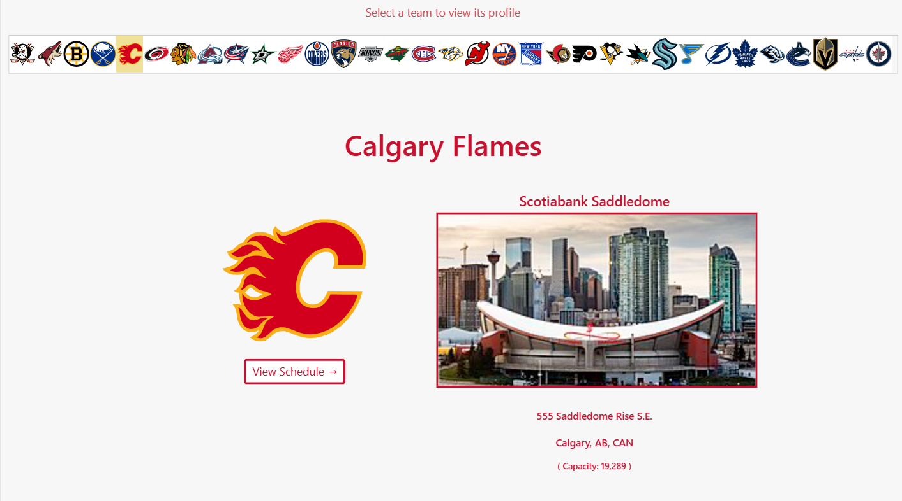
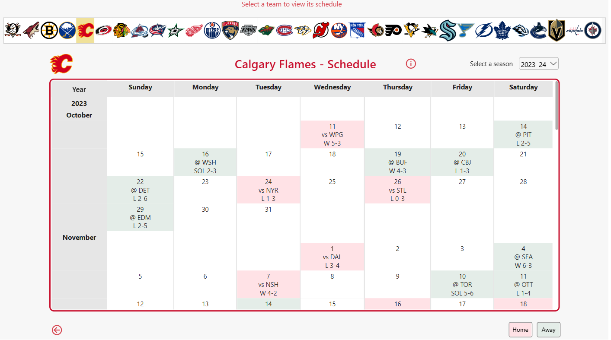
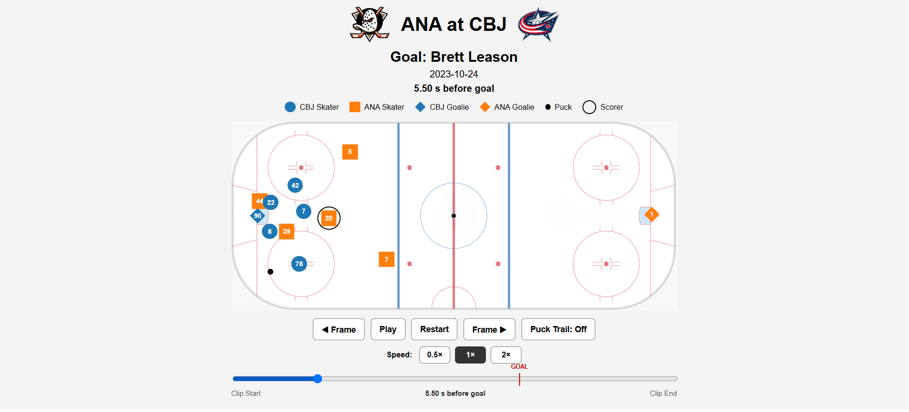

# NHL Hockey Explorer

An interactive NHL analytics project combining Power BI dashboards with browser-based goal tracking animations for the 2023-24 through 2025-26 seasons.

The project provides an interactive way to explore NHL teams, schedules, games, players, goals, and individual goal sequences using both traditional business intelligence reporting and frame-by-frame player and puck tracking data.

## NHL Hockey Explorer Dashboard



## Public Power BI link
https://app.powerbi.com/view?r=eyJrIjoiMWQ5YmVkN2YtN2I2MS00ZDYzLTgyZjMtZDdkNzY2MmU4OGY5IiwidCI6IjlkZjE5Yjk5LTY1NjItNDA4NC04OTlmLWY3NzcxZWNmNDMzNyJ9


## Project Overview

NHL Hockey Explorer consists of two primary components:

### Power BI Report

The Power BI report provides an interactive interface for exploring NHL data.

Features include:

- NHL team selection using team logos
- Team and arena information
- Season selection
- Interactive team schedule calendar
- Game results and scores
- Game-level goal summaries
- Player goal exploration
- Goal details including scorer, period, and shot type
- Links from individual goals to the browser-based goal tracking viewer

### Interactive Schedule



The report currently covers:

- 2023-24
- 2024-25
- 2025-26

The Power BI report file is available in:

`powerbi/NHL_Hockey_Explorer.pbix`

### Interactive Goal Tracking Viewer

Individual goals can be opened in a browser and replayed using frame-by-frame NHL tracking data.

The viewer displays:

- Home and away skaters
- Goaltenders
- Jersey numbers
- Puck movement
- Scoring player identification
- Goal timing
- Optional puck trail
- Timeline scrubbing
- Play / pause
- Previous and next frame controls
- Playback speed controls
- Before and after goal movement

Player and puck locations are animated on an NHL rink using the tracking coordinates associated with each goal.

### Goal Tracking Animation



## Architecture

The application combines Power BI with a lightweight Python web application.

```text
Power BI NHL Hockey Explorer
            |
            | Goal URL
            v
     Flask Web Application
            |
            v
       Cloudflare R2
            |
            v
 Per-Goal Tracking Parquet
            |
            v
   Browser Goal Animation
```

The web application is designed for deployment on Vercel, while the goal tracking files are stored separately in Cloudflare R2 object storage.

This avoids requiring the large tracking datasets to be included directly in the application deployment.

## Technologies

The project uses:

- Power BI
- DAX
- Power Query
- Python
- Flask
- pandas
- PyArrow / Parquet
- JavaScript
- HTML
- CSS
- Cloudflare R2
- Vercel
- Git / GitHub

## Goal Clip Data

The full continuous tracking tables contain millions of player and puck observations.

For the web application, the tracking data is converted into individual Parquet files for each available goal. This allows the web application to retrieve only the data required for the selected goal rather than loading an entire NHL season.

Approximately 24,000 goal clips are available across the three seasons.

Generated tracking data and web clip files are intentionally excluded from this Git repository.

## Repository Structure

```text
nhl-hockey-explorer/
|
|-- powerbi/
|   `-- NHL_Hockey_Explorer.pbix
|
|-- static/
|   `-- rink.png
|
|-- templates/
|   `-- clip.html
|
|-- src/
|   `-- NHL tracking pipeline
|
|-- docs/
|   |-- METHODS.md
|   |-- FIELD_REFERENCE.md
|   |-- DATA_SOURCES.md
|   |-- SCHEMA.md
|   |-- RAW_ARCHIVE.md
|   `-- ORIGINAL_PIPELINE_README.md
|
|-- build_clip_availability.py
|-- build_web_clips.py
|-- web_app.py
|-- requirements.txt
`-- README.md
```

## Data Pipeline and Attribution

NHL Hockey Explorer builds upon the open-source **NHL goal-tracking pipeline** created by GitHub user `eker3777`.

Original project:

`https://github.com/eker3777/nhl-tracking-pipeline`

The original pipeline collects and processes NHL goal-recreation tracking data, play-by-play data, and shift information and produces analysis-ready Parquet datasets.

The original pipeline, processing methodology, validation framework, and supporting documentation remain attributed to their original author.

The original project README has been preserved at:

`docs/ORIGINAL_PIPELINE_README.md`

### NHL Hockey Explorer Additions

This project extends the underlying tracking pipeline with additional analytics and presentation components, including:

- Power BI semantic model and interactive NHL report
- Team information and schedule interfaces
- Game and player goal exploration
- Goal clip availability processing
- Per-goal Parquet generation for web delivery
- Flask goal clip application
- Browser-based player and puck animations
- Goal timeline and playback controls
- Cloudflare R2 object-storage integration
- Web deployment architecture

## Data Availability

The large raw and processed datasets are not stored in this repository.

The original tracking pipeline documentation describes how the underlying NHL data can be obtained and processed.

See:

`docs/ORIGINAL_PIPELINE_README.md`

and the additional documentation in the `docs/` directory.

## Running the Web Application Locally

Install the required Python packages:

```bash
pip install -r requirements.txt
```

The web application requires access to the goal clip object storage.

The following environment variables are used:

```text
R2_ENDPOINT
R2_ACCESS_KEY_ID
R2_SECRET_ACCESS_KEY
R2_BUCKET
```

Credentials should never be committed to the repository.

Once configured, the Flask application can be run locally with:

```bash
python web_app.py
```

## Power BI Integration

Individual goal records in the Power BI report contain links to the web application.

The URL identifies the selected season, game, and event. The Flask application retrieves the corresponding goal tracking file and constructs the animation displayed in the browser.

This connects the analytical Power BI report with the frame-by-frame tracking visualization.

## Project Status

NHL Hockey Explorer is fully deployed and publicly accessible.

The Power BI report is integrated with the browser-based goal tracking viewer, allowing individual goals selected in the report to be replayed using frame-by-frame player and puck tracking data.

## Disclaimer

This project is not affiliated with or endorsed by the National Hockey League.

NHL data and team-related trademarks remain the property of their respective owners.

## License

MIT — see `LICENSE`.

Portions of this repository originate from the NHL goal-tracking pipeline by `eker3777` and remain subject to the applicable original license and attribution.